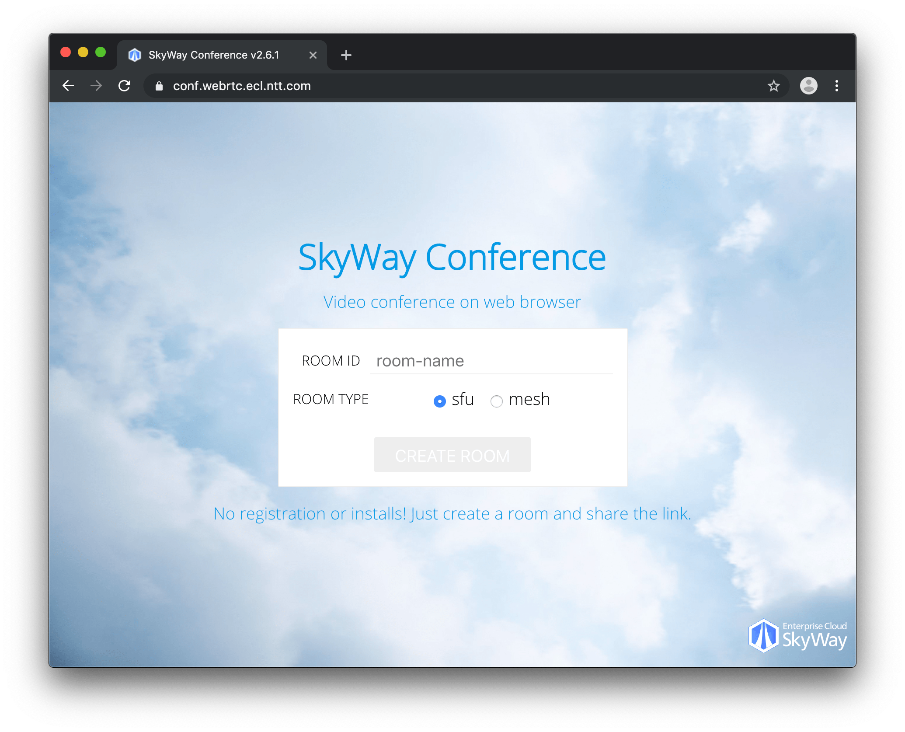
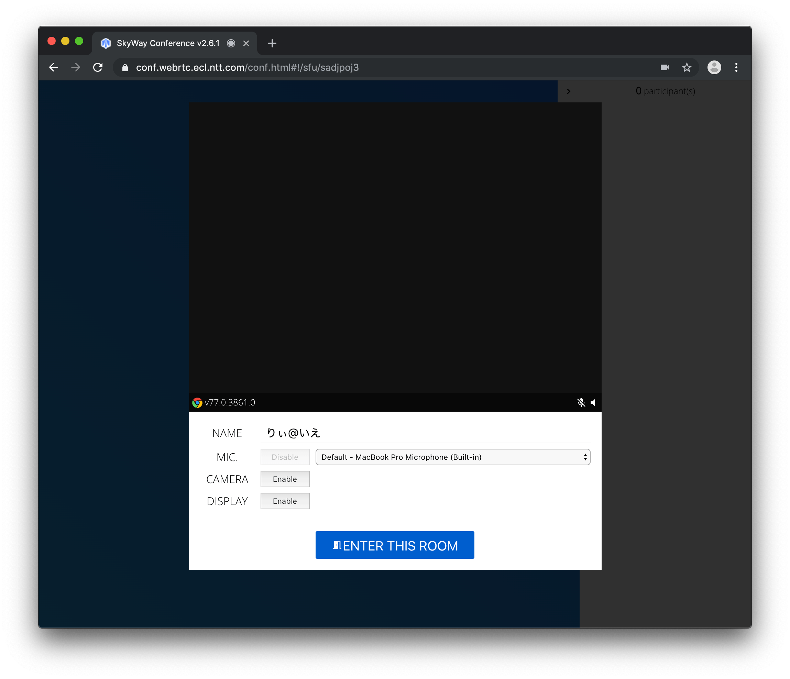
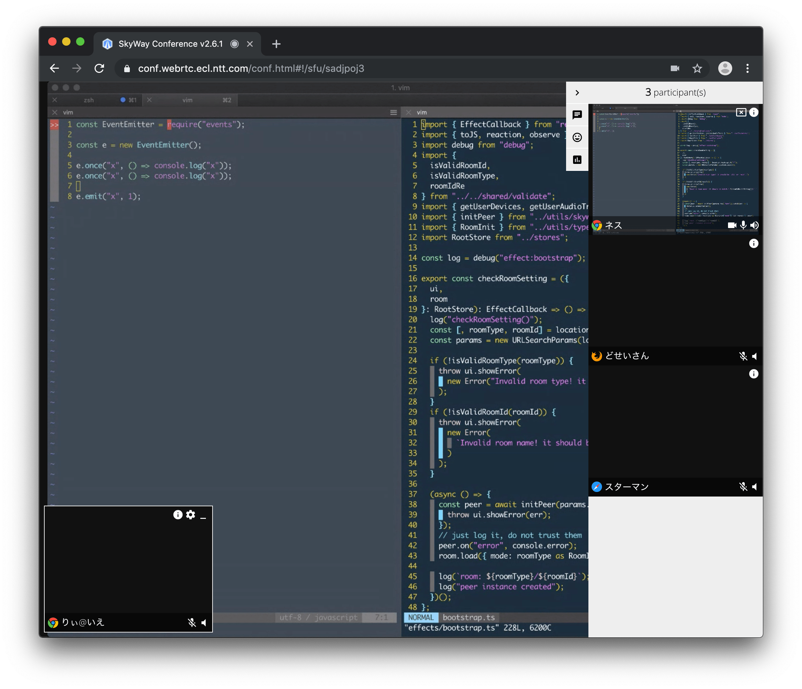
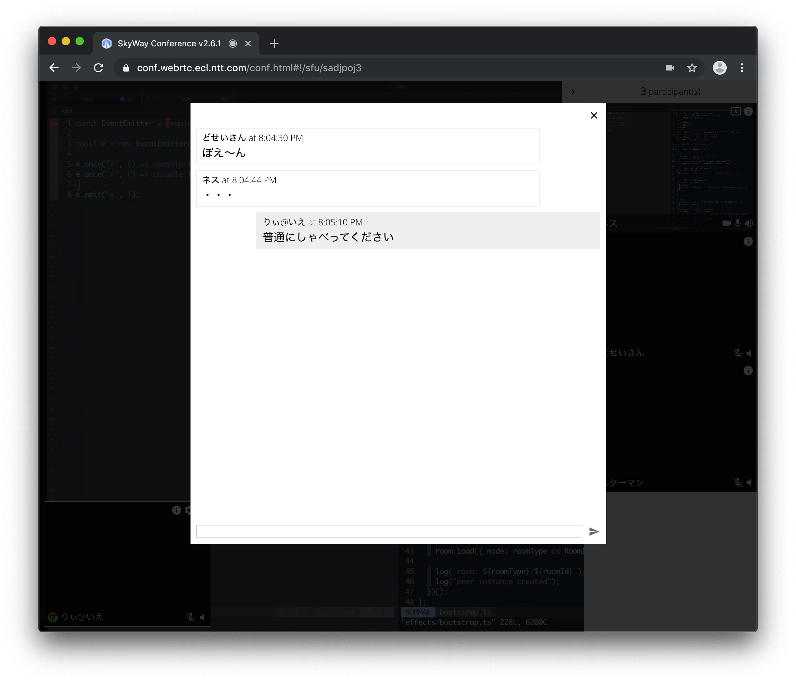
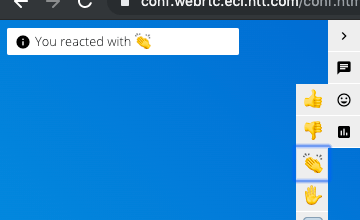

title: SkyWay Conference 〜JS-SDKで作る会議アプリ〜
controls: false
--

# <a>SkyWay Conference</a><br>JS-SDKで作る会議アプリ

## &nbsp;
## 2019/08/21 SkyWay UG Tokyo #4

--

### はじめまして

- Yuji Sugiura
- NTTコミュニケーションズ株式会社
  - WebRTC寄りフロントエンドエンジニア
  - SkyWayの中の人やってます


--

### はじめまして

- Twitter
  - [@leader22](https://twitter.com/leader22)
- GitHub
  - https://github.com/leader22/
- 技術ブログも書いてます
  - [console.lealog();](http://lealog.hateblo.jp/)


--

# 本日のテーマ

--

[](http://conf.webrtc.ecl.ntt.com/)

--

### SkyWay Conference

- SkyWayの<a>JS-SDKを使い倒した</a>Webアプリ
  - いわゆるSPAというやつ
  - React + MobX w/ TypeScript
- JS-SDKのサポートブラウザで動作
  - Chrome/Firefox/Safari
  - iOS/Android含む
- 実はデモとして、公式サイトのトップで公開されてる
  - https://webrtc.ecl.ntt.com/#デモ
  - コードはいまのところ非公開🙈

開発チームでも毎日の朝会から世間話まで、事あるごとに利用中。
多い日はリモートで10人🏠 + 2拠点🏢くらいで利用したりします。

--

### そんな裏側ぜんぶ見せます！

このWebアプリを実装するのに必要な、

- SkyWayのJS-SDKの基本的なAPI
- UIごとの実装方法とTips
- WebRTCのJavaScript APIについてのアレコレ

を紹介します！

--

# SkyWayのAPI
## の中で、今回使うもの

--

### Peer

> Peer - JS SDK API Reference
> https://webrtc.ecl.ntt.com/skyway-js-sdk-doc/ja/peer/


```js
const peer = new Peer({ /* key */ });

// これを待つのが重要
peer.once("open", () => {
  // ...
});
// これを監視するのが重要
peer.on("error", () => {
  // ...
})
```

すべてはここから。

`Promise`でラップして`const peer = await initPeer()`みたいにするもよし。

> https://github.com/skyway/skyway-js-sdk/blob/master/skyway-js.d.ts#L189-L239

--

### Peer#joinRoom()

```js
const room = peer.joinRoom(roomName, {
  mode: "sfu", // or "mesh"
  stream
});
```

`roomName`を指定して部屋に入る。

`sfu`と`mesh`で異なるモードが利用でき、省略すると`mesh`になります。

`stream`には、その部屋に送信したい`MediaStream`を渡します。（videoのみ、audioのみ、video+audio、そもそも渡さない）

--

### {SFU|Mesh}Room

> SFURoom - JS SDK API Reference
> https://webrtc.ecl.ntt.com/skyway-js-sdk-doc/ja/sfuroom/
> MeshRoom - JS SDK API Reference
> https://webrtc.ecl.ntt.com/skyway-js-sdk-doc/ja/meshroom/

`mode`によって異なるRoomになりますが、APIはほぼ一緒。

```js
// 送信するストリームを変えたいとき
room.replaceStream(newStream);

// 部屋にデータを送信したいとき
room.send(data);
```

使うメソッドも2つだけ。

> https://github.com/skyway/skyway-js-sdk/blob/master/skyway-js.d.ts#L147-L174

--

### {SFU|Mesh}Roomのイベント

イベント一覧こちら。

```js
// 自分が部屋にはいった
room.on("open", () => {});

// 誰かが部屋にはいってきた
room.on("peerJoin", peerId => {});

// 誰かが部屋からいなくなった
room.on("peerLeave", peerId => {});

// 誰かのストリームを受信した
room.on("stream", stream => {});

// 誰かのデータを受信した
room.on("data", data => {});

// 部屋が閉じた
room.on("close", () => {});

// なにかエラーがあった
room.on("error", err => {});
```

これだけでほとんど完成してるようなものではある・・。

--

# UIごとの実装解説

--

## ユーザー設定


--

### 部屋に入る

```js
const room = peer.joinRoom(roomName, {
  mode: "sfu", // or "mesh"
  stream
});
```

本UIにおけるSkyWay的な要素は以上です！

--

### デバイス選択

`getUserMedia()`で使うデバイスの取得と、そのデバイスを表すラベルの取得をします。

```js
// 1. まずデバイスの存在有無を確認
const devices = await navigator.mediaDevices.enumerateDevices();
const hasVideoDevices = devices.filter(device => device.kind === "videoinput").length !== 0;

// 2. あったなら、許可を取る
await navigator.mediaDevices.getUserMedia({ video: true });

// 3. 許可が取れたら、ラベルを再取得する
const devicesWithLabel = await navigator.mediaDevices.enumerateDevices();
```

- 2を飛ばすと、`device.label`が取れないなど不都合あり
- 1を飛ばすと、もしビデオ入力がなかった場合に`getUserMedia()`でエラーになる

なんて面倒なんでしょう😇

--

### 続・デバイス選択

取得した`deviceId`を使って、`getUserMedia()`をやり直すだけ。

```js
// device.deviceId を指定
const stream = await navigator.mediaDevices.getUserMedia({
  video: {
    deviceId: { exact: deviceId }
  }
});
```

`exact`をつけるのが重要。

この`stream`を、さっきの`joinRoom()`に渡せばOK。

--

### 画面の共有

拡張なしで動くって素晴らしい😆

```js
const displayStream = await navigator.mediaDevices.getDisplayMedia({ video: true });
const [videoTrack] = displayStream.getVideoTracks();
```

ちなみにコイツの「Stop sharing」は、


`videoTrack.onended`を監視して制御します。

--

### ミュート（簡易）

```js
// mute
videoTrack.enabled = false;

// unmute
videoTrack.enabled = true;
```

`MediaStreamTrack`には`muted`といういかにもなプロパティが生えてますが、お探しのものは`enabled`です👻

これをやると、

- 映像はそれらしい黒画面になり
- 音声は聞こえなく

なります。

`0`とまではいかないものの、帯域の節約になります。

--

### ミュート（発展）

帯域を`0`にしたい！そんなあなたには・・、

- `MediaStreamTrack#stop()`
  - ミュートしたことをリモートに知らせる必要あり
  - ストリームの再取得も必要（再開できない）
- `RTCRtpSender#replaceTrack(null)`
  - ミュートしたことをリモートに知らせる必要あり
  - 解除するには再度`replaceTrack(track)`
- `RTCRtpSender#getParameters() + setParameters()`
  - `params.encodings[0].active = false`にする
  - 同じく知らせる必要あり
- `RTCPeerConnection#removeTrack(sender)`
  - `inactive`にして通信そのものをやめる
  - 解除するには再度ネゴシエーションから

要件に応じてお好きな方法を選んでください！

--

### VoiceActivityDetection

マイクの入力レベルをチェックできます。

WebAudio APIと組み合わせて実装します。

```js
// コンテキストを初期化
const audioContext = new AudioContext();

// streamから入力ノードを作る
const sourceNode = audioContext.createMediaStreamSource(stream);
// 入力をチェックするためのノード
const analyserNode = audioContext.createAnalyser();
// 接続！
sourceNode.connect(analyserNode);

// 任意のタイミングで取得
const fft = new Float32Array(analyserNode.frequencyBinCount);
analyserNode.getFloatFrequencyData(fft);
```

自分で実装してもいいですが、用途が決まってるなら探せばライブラリあります。

> https://github.com/otalk/hark

> https://github.com/Jam3/voice-activity-detection

--

### VAD（おまけ）

> https://w3c.github.io/webrtc-pc/#dom-rtcrtpcontributingsource-audiolevel


お？🕵️‍

```js
const [receiver] = pc.getReceivers().filter(r => r.kind === "audio");
const [{ audioLevel }] = receiver.getSynchronizationSources();
```

条件つきではあるものの、ほぼほぼ使える・・が、各ブラウザで返り値の尺度が微妙に違う・・・！（特にSafariおまえだけは(ry

--

## 参加者とそのストリーム表示


--

### 参加者リスト

人が増えたとき。

```js
const streams = new Map();

// 受け取ったら取っておく
room.on("stream", stream => {
  streams.set(stream.peerId, stream);
});

// 参加者数
const numOfParticipants = streams.size;
```

減ったとき。

```js
// いなくなったら消す
room.on("peerLeave", peerId => {
  streams.delete(peerId);
});
```

--

### ストリームの表示

```html
// ReactのJSXの例
<video srcObject={stream} muted playsInline />
<audio srcObject={stream} />
```

`video+audio`で描画するのがオススメです。（同じ`stream`を渡すだけ）

むしろこうしないと、iOS Safariで複数のストリームを再生できずに詰みます😇

VADしたいなら、この`stream`をさっきと同じように表示すればよし。

--

### ピン留め表示

- 参加者リストのそれとは別に、大きく表示される機能
- 任意の`stream`を、複数の`video`で再生するだけ
  - ただし音はいらない

--

## チャット・その他


--

### チャット

```js
// 送信
room.send("こんにちは");

// 受信
room.on("data", ({ src, data }) => {
  console.log(`peerId: ${src} says ${data}`);
});
```

部屋にいる全ての人に送られる = ブロードキャストされます。

宛先を指定する機能はないです。

--

### リアクション



チャットと同じですが、いろいろ`send()`したくなるので最初から、

```js
// チャット
room.send({ type: "chat", payload: "こんにちは" });
// リアクション
room.send({ type: "reaction", payload: "🆒" });
```

のようにするのが便利です。

```js
room.on("data", ({ src, data: { type, payload }}) => {
  switch (type) {
    case "chat": return handleChat(src, payload);
    case "reaction": return handleReaction(src, payload);
  }
});
```

JSONにできるオブジェクトならそのまま送受信できます。

--

### 通知


- 任意で`room.on()`をひろって表示
- あとはユーザーの操作にあわせて表示
- 参加者のイベントは任意のタイミングで`room.send()`
  - ユーザー名、UA
  - さっきのリアクション
  - 「画面共有をはじめた」など

SkyWayあんまり関係ないですね！

--

### Stats

- 実装の都合でSFURoomでのみ使える
- `RTCStatsReport`を文字列検索できる
  - 各参加者の`stream.id`で検索したり
- なお、コアな人にしか需要はない

--

# おまけ
## JS-SDKよもやま

--

### Room#replaceStream()

現状、`MediaStreamTrack`の増減ができません。

- audio => audio+video への置き換え
  - = videoのtrackが増えてる
- audio+video => audio への置き換え
  - = videoのtrackが減ってる
- audio => video への置き換え
  - = audioのtrackが減ってるし
  - = videoのtrackが増えてる

いったん部屋を`close()`して、再度`joinRoom()`すれば実現・・😨😨😨

--

### extends EventEmitter

すべてのクラスがNodeJSの`EventEmitter`継承です。

つまり、

- オレオレイベントBusとしても使える
  - イベント名が被らないようにだけ注意
- `on()`だけでなく`once()`で1度きり拾える
  - その後にリスナーを手動で剥がさなくていい
- `removeAllListeners(evName)`が使える
  - イベント名だけで全部剥がせる
- `error`イベントは絶対に監視してください
  - さもないと、アプリ全体がエラーになります😇

--

# おまけ
## フロントエンドよもやま

--

### Q. WebRTCと状態管理

- トレンドとしてはステートレス
  - いつでもJSONにできる、復元できる
  - クラスではなくただのオブジェクト
- ただしWebRTC関連のAPIはステートフル
  - `RTCPeerConnection`
  - `MediaStream`
  - etc...

どうするのが正解？

--

### A. 無理に混ぜない

性質が違うなら用途も違うはずなので、ちゃんと分ける。

- 普段のUI管理はステートレスに
- ステートフルなものはそれ用のところに

どちらにせよ、UIコンポーネントの外側の世界に配置すること。（Reactなら`Context`で注入したり）

コンポーネントの中にだけは絶対に書かないでください🤮

--

### SkyWay Conferenceのコードベース

```
src
├── conf
│   ├── components: 状態をもたないコンポーネント
│   ├── effects: 状態を操作する処理（ReactHooks）
│   ├── observers: 状態をもつコンポーネント
│   ├── stores: 状態そのもの（MobX）
│   └── utils: 雑多なもの
├── index
│   ├── components
│   └── utils
└── shared

10 directories, 63 files
```

行数にして`3700`行でした！

TypeScriptな上にCSS in JSな上にほぼコンポーネントなので、ロジックは`1500`行くらいなはず。

設計の詳細はこちらから。

> React HooksとMobXをあわせて使う - console.lealog(); https://lealog.hateblo.jp/entry/2019/05/14/191623

--

# Thank you!

<style>
:root {
  --bg-color: #f7f7ff;
  --bar-color: #c81dff;
  --em-color: #990073;
}
</style>
<link rel="stylesheet" href="../public/base.css">
<script src="../public/mobile-controls.js"></script>
