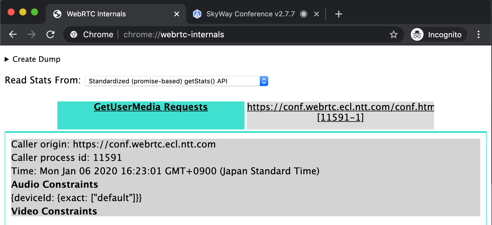
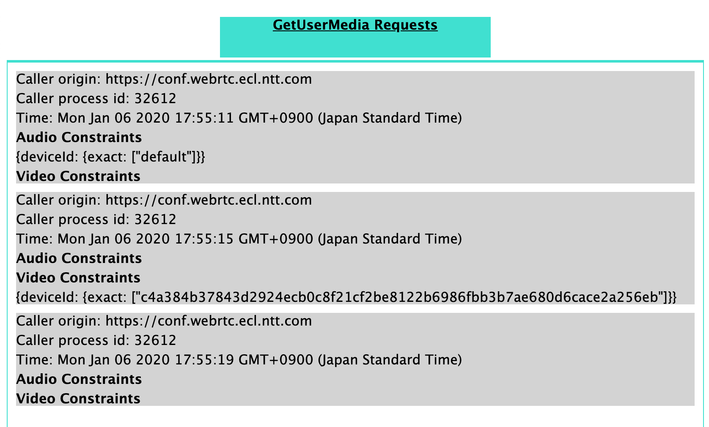
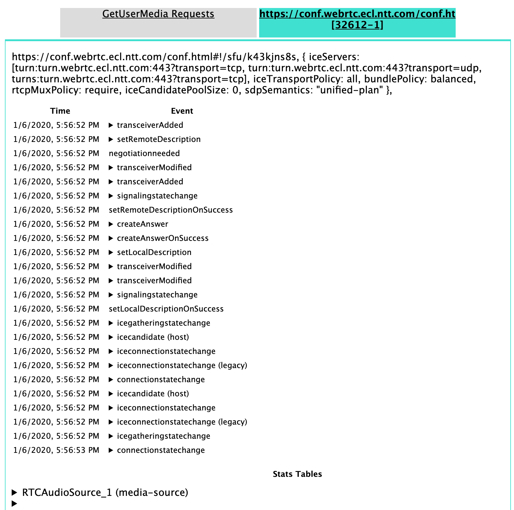
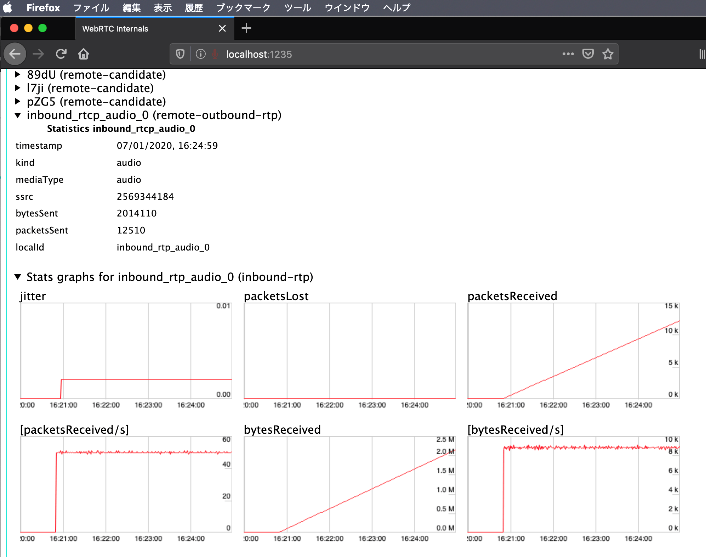

# The `chrome://webrtc-internals` internals
2020/01/15 SkyWay UG Tokyo #6

---

## はじめまして

- Yuji Sugiura
- NTT Communications
  - WebRTC寄りフロントエンド寄りエンジニア
  - いちおうSkyWayの中の人


---

## はじめまして

- Twitter: [@leader22](https://twitter.com/leader22)
- GitHub: [leader22](https://github.com/leader22/)
- Blog: [console.lealog();](https://lealog.hateblo.jp/)


---

# 本日のテーマ

---

## chrome://webrtc-internals


---

## これなに

- WebRTC関連APIの用途をトラッキングできる特別✨なページ
  - `navigator.mediaDevices.getUserMedia(constraints)`
  - （`navigator.mediaDevices.getDisplayMedia(constraints)`）
  - `new RTCPeerConnection(configuration)`とその後
- 🥇: Chromeでのみ利用可能
  - 🥈: Firefoxにも`about:webrtc`というものがある
  - 🥉: SafariはDevToolsにちょっとリッチなロガーがあるだけ...
- 特別ではあるが、その実態はただの**Webページ**

---

## ただのWebページならば

- ChromeのDevToolsでそのしくみを丸裸😻にできる！
- ので、やってみたという話をします

---

# Overview (if needed)

---

## ページのつくり

1. ヘッダ
2. GetUserMedia Requestsタブ（いつでも1つ）
3. PeerConnectionタブ（あるだけタブが増える）

---

# 1. ヘッダ


---

## 各種ダンプのダウンロード

- 通信状況のダンプ（`.txt`だが中身はJSON）
  - いま正に見てるデータをエクスポートできる
  - 特定の環境で収集して、あとで解析するなど
- オーディオ（`.wav`）の録音
  - いま入力されてるマイク音源
  - いま出力されてるスピーカー音源
- パケット、イベントのログ（`.log`）
  - incoming & outgoingのRTPヘッダ
  - RTCPパケット
  - フォーマットはProtocol Buffersっぽい？

---

## バージョン設定

- `getStats()`のバージョン指定
  - ある時を境に、APIと内容が変わった
  - 新旧のどっちを使ってこのページを表示するかの設定
  - デフォルト（`Standarized(promise-based)`）のままが吉

---

# 2. GetUserMedia Requestsタブ



---

## `getXxxMedia()`の様子

- `navigator.mediaDevices.getUserMedia()`を呼ぶとリストが増える
  - いつ
  - どこ（のURL）で
  - どのように
  - メディアをキャプチャしようとしたのか
- `getDisplayMedia()`の情報は、中途半端にしかでない...🤔

---

# 3. PeerConnectionタブ



---

## `RTCPeerConnection`の様子 1/3

- `new RTCPeerConnection()`で生成されたインスタンスの数だけタブが増える
- どこでどんな設定で（`RTCConfiguration`）で作られたか
  - TURNを利用しようとしたか
  - 多重化しようとしたか
  - etc..

---

## 様子 2/3


- 時系列のイベント一覧
  - 候補にあがった通信経路
  - 各種ステートマシンの遷移
  - ネゴシエーションの進行状況
  - どんなSDPをオファー・アンサーしたか
  - etc..

---

## 様子 3/3


- `getStats()`データのサマリ・可視化
  - 何をやりとりすることになったか
  - どのコーデックを使ってるか
  - どの通信経路が選ばれたのか
  - 帯域の利用状況
  - etc..
- 瞬間値を示す表と、推移の見れるグラフ

---

# 本題: そのしくみ

---

## いわゆるシングルページアプリケーション

- `webrtc-internals.html`
  - ただのHTML/CSS
  - SPAなので中身は空っぽ
  - 以下の2つのJSを読み込んでる
- `util.js`
  - 他のページでも使われる系util
  - ただし`chrome://`でのみ使える
  - 今回はどうでもよい
- `webrtc_internals.js`
  - 本体
  - 3000行😇のクラシックなベタ書きコード

---

## 知りたかったこと

- 表示されるデータはどこからくるのか
  - ただのWebページならJavaScriptがすべて処理してるはず
  - 各ページ側ではもちろん送ってない
  - どこから取得してるの・・？
- Chromeでだけ使える特別なものがある？
  - それ用のHTTPの口があるとか
  - グローバルにメソッドが公開されてるとか
- もしかして、我々も使えちゃったり・・？
  - オレオレinternalsが作れるとアツい
- 確かめるべく、3000行のコードぜんぶ読む💪
  - https://gist.github.com/leader22/a7e8db88a5fb304be4e45b73424a1ff5

---

## 読んだ

> [chrome://webrtc-internals のしくみ - console.lealog();](https://lealog.hateblo.jp/entry/2020/01/07/100402)

---

# わかったこと

---

## 3000行の内訳（雑）

- 01%: 初期化の実行
- 03%: グローバル変数・関数の定義
- 04%: タブUI
- 05%: ダンプ機能
- 05%: PeerConnectionイベントリスト
- **82%**: Statsテーブル（表 + グラフ）

---

## データの出どころ

- 描画するためのデータは全てブラウザ（C++）から受け取る
  - 我々がさわれるAPIなどがあるわけではない
- JavaScriptが、`chrome.send(evName)`という特別な関数でメッセージング
  - `chrome://`のページでだけ使える特別なやつ
  - 必要になったタイミングや、タイマーで定期的に呼ばれる
- それをブラウザ（C++）が受けて処理して返す
  - 存在する`RTCPeerConnection`をかき集めたり
  - `RTCStatsReport`を取得したり
  - マッピングされたJavaScript側のグローバル関数を呼んでデータ返す

---

## データのその後

- 渡されたデータの整形・保存はJavaScriptでやってる
  - `window.userMediaRequests`
  - `window.peerConnectionDataStore`
  - ダウンロードできるダンプも、これらをJSONにしたもの
- グラフもただの`canvas`要素
  - リアルタイムではなく1秒ごとに取得 & 描画してる
- そのための3000行でした
  - ほとんどがグラフ描画用の時系列データへのコンバート
  - メトリクスの数が多いので、それぞれのクラスがあってかさんでる
  - ただ現世では不要なコードも多いので実態は2000行くらい

---

## 起点: `addStandardStats()`

- これが呼ばれると最終的にグラフが1フレーム描画される
  - タイマーで1秒に1回くらい呼ばれる
- 渡されてくるデータは、`getStats()`で得られるものと構造が微妙に違うとのこと
  - 微妙にというかぜんぜん違う😑

```js
// |internalReports| is an array, each element represents an RTCStats object,
// but the format is a little different from the spec. This is the format:
// {
//   id: "string",
//   type: "string",
//   stats: {
//     timestamp: <milliseconds>,
//     values: ["member1", value1, "member2", value2...]
//   }
// }
```

> https://github.com/chromium/chromium/blob/master/content/browser/resources/media/stats_rates_calculator.js#L95-L104

---

## そこさえなんとかすれば



- Firefoxでもinternalsできる🦊
- というか、`getStats()`したデータさえあれば
  - Safariでも
  - ネイティブアプリのSDKでも
- ブラウザ差異は依然としてすごいけど・・

---

# まとめ

---

## 便利

- `chrome://webrtc-internals`は便利
- ただのWebページだが、ただのWebページではなかった
- オレオレStatsViewerを作るときはぜひ参考にしよう

---

## `getStats()`それ自体について

- ブラウザの互換性はお察し
  - このネタだけで何回か登壇できる
- 気になる方はあとでお話しましょう🍻

---

# Thank you!
