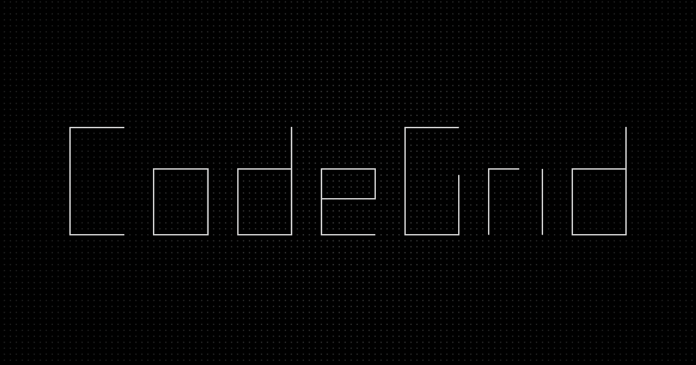

title: 知ってて得するVanilla JS
controls: false
--

# 知ってて得する<br><s>Angular 2</s><br>Vanilla JS

## &nbsp;
## 2016/04/30 ng-kyoto Angular Meetup #4

--

### はじめまして

- Yuji Sugiura / [@leader22](https://twitter.com/leader22)
- フロントエンド・エンジニア at PixelGrid Inc.
- 京都生まれ -> 大阪育ち -> 神奈川(ほぼ東京)在住
- Angular歴3ヶ月(最近はReactばっかり)


--

# 今日はなすこと

--


--


## (とそれにまつわるポエミーなこと)

--

### ご存じですかVanilla JS

- まーた新しい○○.jsか！
  - 違います
- Angular.jsとかReact.jsの仲間ではない
  - jQueryみたいなライブラリでもない
- Vanillaはバニラアイスのバニラ

みんな一度は使ったことあるやつです。

--

### Vanilla JSとは
バニラ ≒ プレーン = 素のJavaScriptのこと

- HTML5 / ブラウザネイティブのAPIを使い倒す
- FWやライブラリを使わず自分で書く

要するに、JavaScriptの基礎力です。

--

# こんな経験ありませんか

--

### 例1: パフォーマンスチューニング

- なんか重いページがあるらしい
- この謎のdirectiveが原因っぽいのはわかったが
- ところがそれは外部のライブラリだった！
- コード読んでもさっぱりわからない！

俺にはチューニングできない＼(^o^)／

--

### 例2: ページに新たなUIを追加したい

- ちょっとしたタブとかアコーディオンとか
- でも自前で実装するのは大変な"気がする"・・
- よーし、UI Bootstrap使っちゃうぞー
- 中身ちゃんと見てへんけど動いた！おｋ！

そこにはタブだけで良かったのに・・、<br>大量の使われてない機能と依存モジュールたちの姿が・・！＼(^o^)／

--

### 例3: 続・ページに新たなUIを

- [jzaefferer/jquery-validation](https://github.com/jzaefferer/jquery-validation)みたいなことしたい
- でもjQueryは使ってない案件
- 他のライブラリも見つからん！
- どう書けば良いかよーわからん・・

もうjQueryいれるしか＼(^o^)／

--

# ＼(^o^)／

--

### この例の何がダメか

- 生きてれば生jsでのチューニングが必要になる時も
- そのライブラリは本当に適切か
  - 1機能のために使わない機能を10入れますか？
- 他人(ライブラリ)頼みでは、いざという時に困る

フルスタックなAngularも今話題のReactも、中身はただのJavaScriptです。<br>
<s>基礎もできてないのにAngularがどうとか(ry</s>

--

### Vanilla JS力もとい基礎力が高まると

- 依存なしの最速・最軽・無駄のないコードが書ける
  - 得体のしれないライブラリを使わなくて済む
- ライブラリが抽象化してる内容を推測できる
  - 拡張やFolkも容易
  - バグの原因の予想がつきやすい
  - 必要・不要の選択ができる <- コレ重要

書ける！読める！もう何も恐くない！

--

### 最近よく見る

- まーた新しい○○.jsが・・
- ○○は死んだ / ○○はオワコン
- 最近のフロントエンドは変化が云々・・

( ˘ω˘).｡o( またその話か... )

--

### 春やからね

- まーた新しい○○.jsが・・
  - それは本当に新しいのか
- ○○は死んだ / ○○はオワコン
  - ユースケースが違うだけでは
  - 勝手に殺さないで
- 最近のフロントエンドは変化が云々・・
  - 本質も変化してますか？

キャッチーな煽り記事にのせられて、一緒に揺らがないようにしたいですね。

--

### どうすればいいのか

- 目的が複雑化しているので、当然手段も複雑化する
  - 代価が必要なのは当たり前
  - 目的に応じて道具が変わるだけ
- 時の流れには逆らえない
  - 善し悪し関係なく新しい選択肢が増える

これを踏まえた上で、<br>
自分に必要かどうかを見極めるのが大事。<br>
全てを追う必要はないです。(知ってて損はないけど)

--

### ⚠お断り

- ライブラリを使うこと = 悪ではない
- 要件や環境に応じて「選択」が必要
- 正しい「選択」のために、見極める目と力を
- やってることを理解した上で楽をする

昨今のイケイケなWebアプリをVanillaでやるのがつらいのは事実・・・`_(:3」∠)_`

--

# そこでVanilla JS

--

### 安心してください

- Vanilla JSは死なない(可能性が高い)
  - たとえjsが死んでもスタンスは次に生かせる
- 何を使うにしても無駄にはならない

ね、安心でしょう？

--

### はじめようVanilla JS

最新のモダンブラウザは違いをほぼ意識しないでOK

- Chrome / FireFox / Edge

そして今や、

- レガシーIEのサポート終了
- iOSも9.x / Androidも5.x

ブラウザ間の差を埋めるPolyfillの出番も、着実に減少中。

--

# Vanilla JS事例

--

### PixelGrid Inc.


## https://www.pxgrid.com

--

### jsでやってること

- 各ページURLで必要な関数を実行(= ルーター)
- タブ / 開閉パネル
- ページ内SmoothScroll
- SVGのアクセスマップ制御
- お問い合わせ・採用応募フォーム
  - フォームバリデーション
  - Ajaxでのフォーム送信
- etc..

依存ライブラリなしなので容量わずか`4.1KB`(gzip)！<br>
ちなみにjQuery@2.2は`34.6KB`

--

### なぜVanillaでやったのか

- 単純なUIしかない
  - jQueryもUnderscoreも全機能は不要と判断
- 最新ブラウザだけがターゲット
- どうせメンテするの弊社

株式会社ピクセルグリッドは、JavaScriptの会社です！

--

# Vanillaなコードの紹介

--

### DOMの取得

```javascript
// jQuery
$('#el');
$('.els');

// Vanilla
document.getElementById('el');
document.getElementsByClassName('.els');

// Easy but..
document.querySelector('#el');
document.querySelectorAll('.els');
```

便利な`qS`と`qSA`ですが、一部レガシーな環境でパフォーマンスが落ちるので注意(体験談)

--

### DOMの操作

```javascript
// jQuery
$('.els').each(function() {
  this.text('Angular!');
});

// Vanilla
var $els = [].slice.call(document.getElementsByClassName('.els'));
$els.forEach(function(el) {
  el.textContent = 'Angular!';
});

[].forEach.call(document.getElementsByClassName('.els'), function(el) {
  el.textContent = 'Angular!';
});

// ES 2015
var $els = Array.from(document.getElementsByClassName('.els'));

Array.from(document.getElementsByClassName('.els'), function(el) {
  el.textContent = 'Angular!';
});
```

--

### 配列

```javascript
var array = ['A', 'n', 'g', 'u', 'l', 'a', 'r', '2'];

// _
_.each(array, fn);
_.map, _.filter, _.reduce, _.some, _.every;
_.contains(array, 'A');

// Vanilla
array.forEach(function(item, idx, arr) {});
array.map, array.filter, array.reduce, array.some, array.every;

// ES Next
array.includes('A');
```

ちょっと組み合わせれば、だいたいのことは書ける。

-- 

### オブジェクト操作

```javascript
// _
_.extend({ name: 'leader22' }, { age: 29 });

// ES 2015
Object.assign({ name: 'leader22' }, { age: 29 });
```

`Object.freeze()`, `seal()`, `preventExtension()`とかも便利。

--

### クラス名の操作

```javascript
// jQuery
var $el = $('#el');
$el.addClass('is-selected');
$el.removeClass('is-selected');
$el.toggleClass('is-selected');
$el.hasClass('is-selected');

// Vanilla
var $el = document.querySelector('#el');
$el.classList.add('is-selected');
$el.classList.remove('is-selected');
$el.classList.toggle('is-selected');
$el.classList.contains('is-selected');
```

--

### Ajax

```javascript
// jQuery
$.ajax({
  url: '/foo',
  method: 'POST',
  dataType: 'json',
  data: { a: 1 }
})
.then(fn);

// Vanilla
var xhr = new XMLHttpRequest();
xhr.open('POST', '/foo', true);
xhr.setRequestHeader('Content-Type', 'application/json');
xhr.responseType = 'json';
xhr.onload = fn;
xhr.send(JSON.stringify({ a: 1 }));

// Near future
fetch('/foo', {
  method: 'POST',
  headers: { 'Content-Type': 'application/json' },
  body: JSON.stringify({ a: 1 })
})
.then(fn);
```

--

### CSS

```javascript
// jQuery
$(el).css('display');

// Vanilla
getComputedStyle(el)['display'];
```

そもそも使う機会あんまりないけどな・・・。

--

### イベント発火

```javascript
// jQuery
var $btn = $('#button');
$btn.trigger('click');

// Vanilla
var $btn = document.getElementById('button');
$btn.dispatchEvent(new Event('click'));
```

昔は`createEvent()`とか`initEvent()`とか面倒やったけど、今は昔だ！

--

### EventEmitter

```javascript
var EE = require('events').EventEmitter;
var ev = new EE();

ev.on('foo', function() { console.log('foo'); });
ev.emit('foo'); // "foo"
```

いつもだいたい`on()`と`emit()`くらいしか使ってないそこのあなた！

--

### EventEmitter

```javascript
function EE() {
  this._events = {};
  return this;
}

EE.prototype = {
  constructor: EE,
  emit: function(ev) {
    var args = [].slice.call(arguments, 1),
        handler = this._events[ev] || [];
    
    for (var i = 0, l = handler.length; i < l; i++) {
      handler[i].apply(this, args);
    }
  },
  on: function(ev, handler) {
    var events = this._events;
    (events[ev] || (events[ev] = [])).push(handler);
  }
}

return EE;
```

たった20行です。

--

### EventEmitter

```javascript
window.addEventListener('message', handleMsg, false);

function handleMsg(ev) {
  if (ev.origin !== location.origin) { return; }
  var msg = ev.data;

  var type = msg.type; // "foo"
  var data = msg.data; // {}
}

window.postMessage({ type: 'foo', data: {} }, location.origin);
```

だいたいコレで事足りると思いません？

--

### FormValidation

<form id="myForm">
  <input name="name" type="text" required>
  <input name="email" type="email" required>
  <button type="submit">Send</button>
</form>

```html
<form id="myForm">
  <input name="name" type="text" required>
  <input name="email" type="email" required>
  <button type="submit">Send</button>
</form>
```

```javascript
var $form = document.getElementById('myForm');

// form全体
$form.checkValidity();

// email
$form.email.checkValidity();
```

正規表現とか書かんでも良い！<br>
(おすすめせんけど)厳密にチェックしたい人はがんばって・・

--

### オフライン検知

```javascript
window.addEventListener('online',  handleNWChange, false);
window.addEventListener('offline', handleNWChange, false);

function handleNWChange() {
  // navigator.onLine
}
```

他にもバッテリー状況とか取れる。

```javascript
// Chromeならもう使える
navigator.getBattery().then((battery) => {
  // battery
})
```

そのうち回線種別とか照度まで取れるようになるらしい！

--

### More, more and more!

- http://kangax.github.io/compat-table/es6/
- http://kangax.github.io/compat-table/esnext/
- https://github.com/tc39/ecma262

自分で追うのが辛いなら、追ってそうな人を追うのも○<br>
ただいろんな人がいるのでご注意ください。

--

# おわりに

--

### まとめ

- ライブラリ無しでもできることが多いことを知ろう
- 何をやってるか把握した上でライブラリは使おう
- 人任せにせず、自分で「選択」できるようになろう

では引き続き、Angularの偉大さを感じてください(˘ω˘ )

--

### 宣伝: そんなPixelGridといえば



## https://app.codegrid.net/
## ＼Vanillaはもちろん、Angular記事もReact記事も！／

--

### Links

このスライド<br>
http://leader22.github.io/slides/ng_kyoto-4/

--

# Finish!

<script>
var timer = document.createElement('div');
timer.textContent = '0';
timer.id = 'timer';
document.body.appendChild(timer); 

setInterval(function() {
  var now = timer.textContent|0;
  timer.textContent = '' + (now + 1);
}, 1000 * 1);
</script>

<style>
#timer {
  position: fixed;
  right: 0;
  top: 0;
  z-index: 1;
  color: inherit;
  font-size: 10%;
  padding: 5px;
}
.progress {
  z-index: 1;
}

.progress-bar {
  background-color: #792362;
}

a {
  color: #792362!important;
}

h1 {
  font-size: 220%;
}

h3 {
  border-color: #792362;
}

pre {
  border: 1px solid #792362;
  padding: 2%;
  background-color: #fff;
}

ul {
  padding: 10px 0 10px 60px;
}

.slide-content {
  overflow: scroll;
}

.slide-content img {
  display: block;
  margin: 0 auto;
  max-width: 80%;
}
</style>