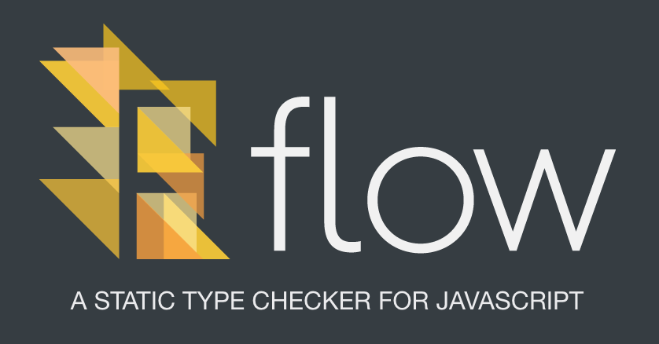

title: 0からはじめるFlow
controls: false
--

# 0からはじめるFlow

## &nbsp;
## 2016/06/29 Node学園 21時限目

--

### はじめまして

- Yuji Sugiura / [@leader22](https://twitter.com/leader22)
- フロントエンド・エンジニア at PixelGrid Inc.
- 前々回にイカの話してたやつです


--


## 本日のお題

--

# 1.名前は知ってる人！

--

# 2.さわったことが<br>ある人！！

--

# 3.TodoAppより大きい<br>案件で使ってる人！！！

--

### 3の人へ

- なんか間違ってたら教えてください！
- 聞きたいことがあります！！

後の懇親会では是非ともよろしくお願いします！！！

--

### あらためまして
「0からはじめる」というタイトルですが、正確には、

- ほぼJavaScriptしか知らない私が
- 型のある世界に飛び込んで
- 案の定いろいろハマって
- あれこれもがき苦しんだことを

これからはじめる1, 2の人に伝えたい10分間です。

--

### そんな汗と涙の結晶

- \#スーパーイカメーカー
- https://github.com/leader22/ika-maker
- DAU: 1000ちょい
- アプリとしての規模は大きくない


--

# というわけで
## \#スーパーイカメーカーに<br>後からFlowを導入して<br>その過程でハマったことと学びについて

--

# 導入準備編

--

### 必要なもの

- `flow-bin`
  - Flow本体
- `babel-plugin-transform-flow-strip-types`
  - 型の定義(!== js)をはずすやつ
- `babel-plugin-transform-class-properties`
  - https://github.com/jeffmo/es-class-fields-and-static-properties <- これが地味に重要

--

### モジュールの方式によって

Classに型をつけた瞬間にBabelのコンパイルがコケる！

- CommonJS x transform-class-properties
  - `transform-flow-strip-types`足すだけ
- ES Modules x transform-class-properties
  - `transform-flow-strip-types`足すだけ

当たり前だが`transform-class-properties`を使ってるなら問題ない。

--

### でもStage1やし・・

- CommonJS
  - `passPerPreset`（後述）で先に`transform-flow-strip-types`する
  - OR おとなしく `transform-class-properties`足す
- ES Modules
  - `transform-class-properties`するしかない
  - `passPerPreset`で先に`transform-flow-strip-types`してもダメ

環境整備の段階でコケられると心がまじで折れる・・。

--

### `passPerPreset`

Babel 6.5から入ったプラグイン、プリセットの処理順を指定できる機能。

```javascript
// .babelrc
{
  passPerPreset: true,
  presets: [
    {
      plugins: [ "babel-plugin-transform-flow-strip-types" ]
    },
    "es2015",
    "react"
  ]
}
```

コレまだEXPERIMENTALなので、おとなしく`transform-class-properties`足しましょう・・。

--

# 導入編

--

### 作業の流れ

やるからにはきっちり型つけたい

- 1ファイルずつ、`@flow`コメントをいれる
- Flowに怒られる部分があるので、そこをなおす
- より厳密にしたい部分に型を付けていく

ね？簡単でしょう？

--

### 既存コードに後から型付けるの is 大変

```javascript
// 元コード
const FOO = {
  1: 'foo',
  2: 'bar',
};

// なおした
const FOO = {
  '1': 'foo',
  '2': 'bar',
};
```
オブジェクトに数値キーがダメやったり。

--

### 既存コードに後から型付けるの is ...

```ts
// 元コード
function foo(val) {
  val = val|0;
  // ...
}

// 型付けた（ら怒られた）
function foo(_val: string) {
  const val: number = _val|0;
  // ...
}

// なおした
function foo(_val: string) {
  let val: number = parseInt(_val, 10);
  val = isNaN(val) ? 0 : val;
}
```

ビット演算子でキャストするのもダメ。

--

### 既存コードに ...

```ts
onChangeInput(ev: Event) {
  const action: SetTextAction = {
    target: this.props.partsName,
    text:   ev.target.value // ココでエラー
  };
  this.dispatch('set:text', action);
}

// ev.targetはEventTargetであると同時にHTMLInputElement
// そして`value`プロパティがあるのはそっちなので、Dynamic Type Testsして回避する
onChangeInput(ev: Event) {
  if (ev.target instanceof HTMLInputElement) {
    const action: SetTextAction = {
      target: this.props.partsName,
      text:   ev.target.value
    };
    this.dispatch('set:text', action);
  }
}
```

他にも似たようなのが色々出てくるが、面倒くさいと思ってはいけない・・(˘ω˘ )

--

### 困ったときのコメント

```sh
# .flowconfig
[options]
suppress_comment= \\(.\\|\n\\)*\\flow-disable-line
```

こう書いておくと、

```ts
// flow-disable-line
const str: string = 1;
```

その行のエラーを無視できる・・・！

--

# そもそも困る前に

--

### 必読ドキュメント

#### [Flow | Quick Reference](https://flowtype.org/docs/quick-reference.html)
<s>だいたいのこと書いてるけど困った時は助けてくれない</s>

#### [flow/lib at master · facebook/flow · GitHub](https://github.com/facebook/flow/tree/master/lib)
Flow側で定義済みの型が置いてあるディレクトリ

- core.js
- dom.js
- cssom.js
- react.js <- 身内やん

--

### 余力あれば

#### [Advanced features in Flow - sitr.us](http://sitr.us/2015/05/31/advanced-features-in-flow.html)

ドキュメントに載ってない記法が紹介されてる（1年前の記事）・・・

#### [flow/type_annotation.ml at master · facebook/flow · GitHub](https://github.com/facebook/flow/blob/master/src/typing/type_annotation.ml#L147-L328)

ドキュメントに載ってない記法が実装されてるぽい箇所（OCaml読めません）

--

# 続・導入編

--

### Destructuringに型

```ts
const A = { a: '1', b: 2, c: true };
const { a, b, c, }: { a: string, b: number, c: boolean } = A;

// コレはダメ
const { a: string, b: number, c: boolean, } = A;
```

公式のDestructuringのページに書いてないからねコレ！

#### 普通のオブジェクトに型

```ts
const A: {
  a: string, b: number, c: boolean,
} = { a: '1', b: 2, c: true };
```

さっきとは逆で、型 > 値の順。

--

### Typeエイリアス
自分で型を作れる機能。

```ts
// 'A'という文字列 || 'B'という文字列
type AorB = 'A' | 'B';

// これらの型を持つObject
type TabItem = {
  id:    string,
  order: number,
  group: string,
  name:  string,
};

// そんなObjectの配列
type TabItems = TabItem[];
// 違う書き方
type TabItems = Array<TabItem>;
```

FluxのActionをまとめたり。

--

### $Keys&lt;T&gt;（元 $Enum&lt;T&gt;）

ドキュメントに載ってない記法シリーズ。

```ts
const CARD_TYPES = {
  "Diamonds": "Diamonds",
  "Clubs":    "Clubs",
  "Hearts":   "Hearts",
  "Spades":   "Spades"
};

type CardTypes = $Keys<typeof CARD_TYPES>;
```

としておいて、

```ts
const type1: CardTypes = 'Diamonds'; // ok
const type2: CardTypes = 'Fooo'; // error
```

まぁもちろんEXPERIMENTALなんでしょうね。

--

### 続きはWebで

0からはじめるFlow Part.1<br>http://lealog.hateblo.jp/entry/2016/06/21/104558

0からはじめるFlow Part.2<br>http://lealog.hateblo.jp/entry/2016/06/21/104558

--

# いまのきもち

--

### やってみてよかった

- 謎の安心感
- 型推論すごい便利
- typoとかもすぐわかる <- 重要
- W3Cの仕様書とかも読みやすくなる
- 変数名から型を匂わせる記載も消えてすっきり

コスパの良いツールだと思うので、Babelれる新規プロジェクトでは前向きに使っていきたい所存。

--

### でもあんまり流行ってない・・？

- 検索しても全然引っかからん
- 日本語の関連記事は全部読んだ感ある
- TodoApp以上のサンプルがない
- 公式のExampleがしょぼい

使われてないのか、みんな内緒にしてるのか！

--

### flow-typedさん...
#### https://github.com/flowtype/flow-typed

- Flow版の[DefinitelyTyped](https://github.com/DefinitelyTyped/DefinitelyTyped)
- まだ44コしか登録されてない（2016/06/24時点）

ココはさすがのTypeScript？

--

### 型付けのベストプラクティス知りたい

- 効率的な・より的確な型の付け方とは・・
- 型を定義するファイルをどこに置くべきとか
- ジェネリクスとかいつ使うの

型々してる人！ぜひこのあと教えてください！

--

# Thank you!

<script>
// 時間管理するの面倒なので経過時間をこっそり出す
(function(global) {
  const timer = document.createElement('div');
  timer.textContent = '0';
  timer.id = 'timer';
  document.body.appendChild(timer); 

  setInterval(function() {
    const now = timer.textContent|0;
    timer.textContent = '' + (now + 1);
  }, 1000 * 1);
}(this));

// モバイルでcontrolsない場合に詰むので
(function(global) {
  const isMobile = 'ontouchstart' in global;
  if (isMobile === false) return;
  
  document.body.addEventListener('click', (ev) => {
    const isRight = (global.innerWidth / 2) < ev.clientX;
    const dir = isRight ? 1 : -1;
    global.navigate(dir);
  }, false);
}(this));
</script>

<style>
:root {
  --bg-color: #FAF2E6;
  --bar-color: #D68B00;
  --em-color: #D68B00;
}

#timer {
  position: fixed;
  right: 0;
  top: 0;
  z-index: 1;
  color: inherit;
  font-size: 10%;
  padding: 5px;
}

.progress {
  z-index: 1;
}

.progress-bar {
  background-color: var(--bar-color);
}

a,
a:hover {
  color: var(--em-color);!important;
}

h1 {
  font-size: 220%;
}

h3 {
  border-color: var(--bar-color);
}

pre,
code {
  background-color: #fff;
}
pre {
  padding: 2%;
}
code {
  padding: 0 2%;
}
pre > code {
  padding: 0;
}

ul {
  padding: 10px 0 10px 60px;
}

.slide {
  background-color: var(--bg-color);
}

.slide-content {
  overflow: scroll;
}

.slide-content img {
  display: block;
  margin: 0 auto;
  max-width: 50%;
}
</style>